# Gridly for UE4

Gridly is the #1 headless CMS for Multilingual Game Development.

Manage your game’s data as a single source of truth and roll out continuous updates with full localization support & version control.

## Prerequisities

- Unreal Engine 4.26.0

## Getting Started

Before you use Gridly, you will need to sign up for an account at https://www.gridly.com

Download the Gridly plugin itself, as well as the sample project to get you started:

- [Gridly UE4 Plugin](https://bitbucket.org/localizedirect/gridly-ue4-plugin)
- [Gridly UE4 Sample Project](https://bitbucket.org/localizedirect/gridly-ue4-plugin-sample-project)

The sample project is optional, but provides a working example project for reference that has a very basic user interface set up for localization in UE4.

### Setting up a Project for Localization

Gridly plugin for UE4 leverages Unreal's built-in tools for localization. If you are not familiar with Unreal's localization pipeline, please consult [their documentation](https://docs.unrealengine.com/en-US/ProductionPipelines/Localization/Overview/index.html).

This guide assumes that you are already familiar with Unreal's tools, and that you've correctly set up all the text in your project for localization using this workflow. The plugin supports both inline source strings and the use of StringTables.

### Installing the Plugin

The plugin can be installed as either an engine plugin or a project plugin.

#### As a Project Plugin

- Extract the contents of Gridly UE4 Plugin repository to `Plugins/Gridly` (relative to project root).
- Generate project files for the project and build the project to compile the required DLLs for the project plugin.

#### As an Engine Plugin

- Extract the contents of Gridly UE4 Plugin repository to `Engine/Plugins/Gridly` (relative to engine root).
- Generate project files for the engine and build again to compile the required DLLs for the plugin.

### Enabling the Plugin

To enable the plugin in your project, go to `Edit -> Plugins` and search for `Gridly`.

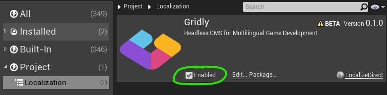

Once enabled, restart Unreal to load the plugin.

### Changing the Localization Service Provider

In the Localization Dashboard, you should now be able to choose Gridly as your Localization Service Provider. Once selected, close the Localization Dashboard and re-open it to load the toolbar buttons.

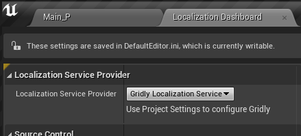

If you do not have access to the Localization Dashboard, you need to enable it. Go to `Edit -> Editor Preferences` and search for `Localization Dashboard` to activate it.

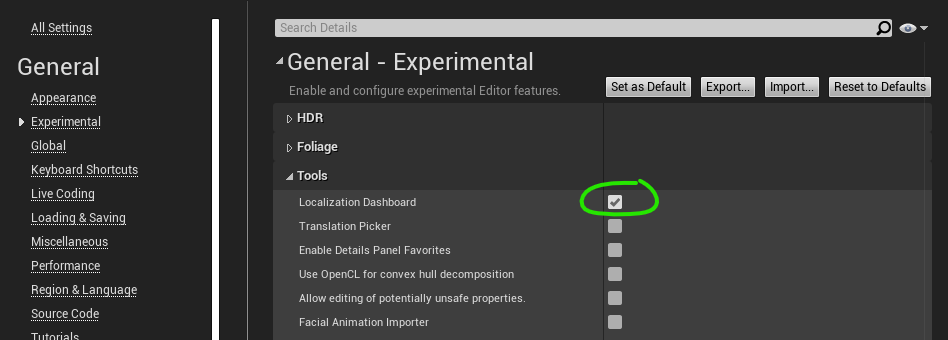

Once enabled, restart Unreal to be able to find the Localization Dashboard option under `Window -> Localization Dashboard`.

## Export/import to/from Gridly

Before you can export your source strings to Gridly, you need to first set up a new Grid in Gridly. Here is an example using [FIGS](https://en.wikipedia.org/wiki/FIGS):

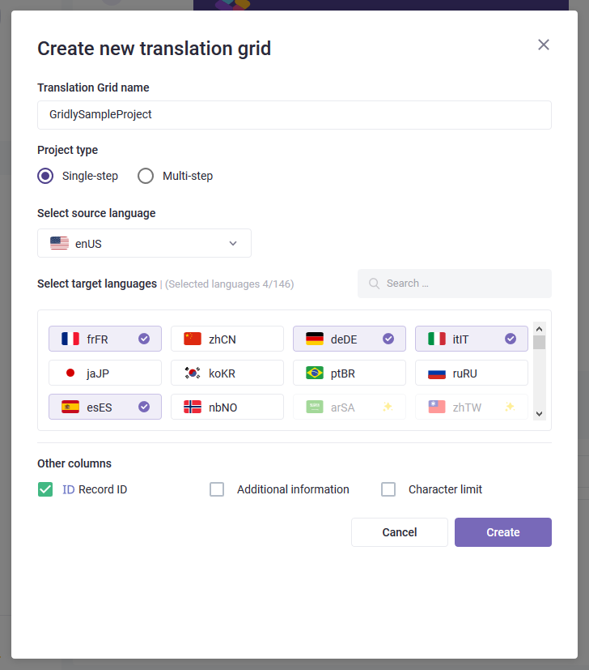

You will also need to set up your project to target the same cultures in the Localization Dashboard.

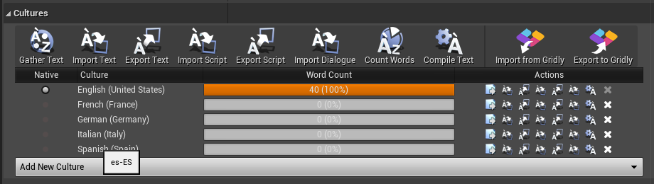

Make sure these locale/culture codes match the ones on Gridly (hover over them to show tooltip). If you have previously set this up with codes that do not match those in Gridly, or you wish to map them in a different way, see how you can [customize the mapping](#markdown-header-custom-culture-mapping).

### Setting up the API keys and view IDs

To communicate with the API, you need to make sure that you have configured the plugin to use the correct API keys. You also need to set which view IDs you wish to use for import/export. See [import/export settings](#markdown-header-importexport-settings) for more information.

### Exporting Native Source Strings

Once you have made sure that your source and target languages are set up correctly and matching in both Unreal and on Gridly, and you have gathered all your source text, you can now export all source strings by pressing the `Export to Gridly`-button on the Localization Dashboard.

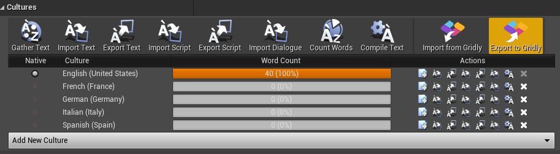

After export, open the Grid in your browser to edit the translations in the browser (may require refresh to see changes).

### Importing Translations

After you're done translating, you can import translations for all target cultures back to project with just a single click.

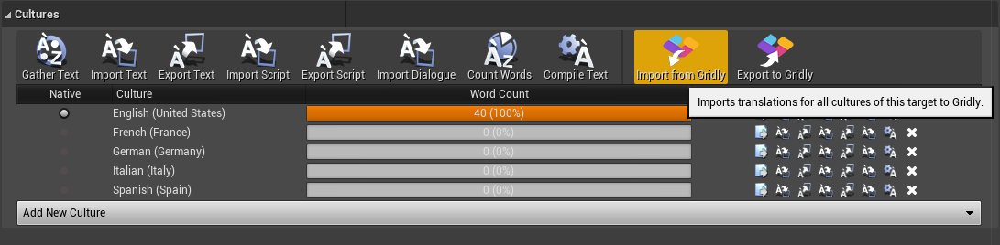

## Live Preview

The Gridly plugin also supports updating translations during runtime using the provided Blueprint functions to enable preview mode:

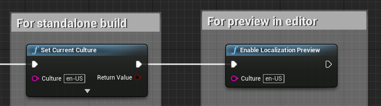

After making changes on Gridly, the translations can then be updated using the following:

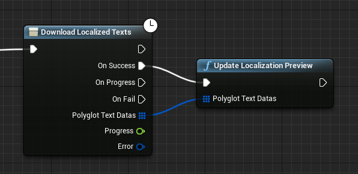

While possible, it is currently *not* recommended to use this mode in a production build! This functionality is for development only (either in PIE mode or Development build). When final translations are ready, you should import your translations [through the Localization Dashboard](#markdown-header-importing-translations).

## Configuring Gridly

All the settings for Gridly can be found in `Edit -> Project Settings -> Plugins -> Gridly`. They can also be found in `Config/DefaultGame.ini` if you prefer to edit these options by hand.

### Import/export Settings

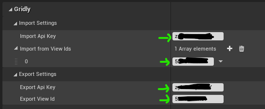

- *Import Api Key*: This is the API key used for importing translations from Gridly.
- *Import from View Ids*: This is a list of view IDs on Gridly to import from. We will fetch from all view IDs and combine the results. Only one record will be used in case of duplicate record IDs. This will be used for both regular import as well as in Live Preview mode.

- *Export Api Key*: This is the API key used for exporting source strings. Make sure it has write-permissions.
- *Export View Id*: This is the view ID on Gridly that source strings should be exported to.

### Column Mapping Options

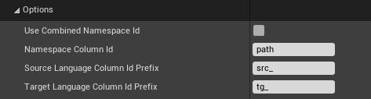

- *Use Combined Namespace Id*: If you have specified a namespace for your source strings, it will be combined with the key before being sent to Gridly, in the form of `Namespace,Key`. Likewise, it will expect the record ID fetched from Gridly to be in this form and convert it during import. Do not change once configured!

- *Namespace Column Id*: The column ID on Gridly to map the namespace in Unreal to. By default, this is `path`, which is the path tag column. This can be set to any column ID that is configured to be a string. Set this to empty to ignore the namespace. This option works for both import and export. Do not change once configured!

- *Source Language Column Id Prefix*: All source language columns on Gridly are expected to use culture mapping as configured below and prefixed with this value. Make sure this matches the column IDs on Gridly.

- *Target Language Column Id Prefix*: All target language columns on Gridly are expected to use culture mapping as configured below and prefixed with this value. Make sure this matches the column IDs on Gridly.

### Custom Culture Mapping

By default, the Gridly plugin will automatically convert language/culture codes of the format `en-US` in Unreal to what Gridly uses, which is generally `enUS` (without the hyphen). You can also completely customize this behaviour by using custom culture mapping.

